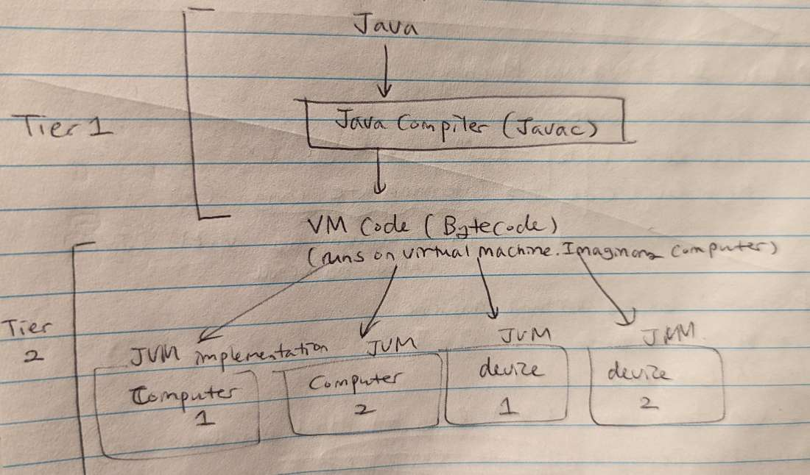

# nand2tetris
[Build a Modern Computer from First Principles: From Nand to Tetris](https://www.nand2tetris.org/) offered by Hebrew University of Jerusalem

# Objective
Build a fully functioning general purpose computer, both hardware and software components, from scratch.\
This computer follows [Von Neumann Architecture](https://www.computerscience.gcse.guru/wp-content/uploads/2016/04/Von-Neumann-Architecture-Diagram.jpg).
# What I have learned from the course
## Week 1
Project: implement boolean logic of 15 elementary logic gates using Hardware Description Language (HDL)

### 2 ways to describe a boolean function:
1. Boolean formula
2. Truth table
   
Going from (1) -> (2): substitute possible input values and evaluate the output\
Going from (2) -> (1): construct a disjunctive normal form formula and simplify the expression using boolean identities

### Boolean Identities


### Important & Interesting Theorem
Any boolean function can be represetned only using AND, NOT and OR gates\
--> Any boolean function can be represetned only using AND and NOT gates
  > Proof: X or Y = NOT (NOT X AND NOT Y) --  De Morgan's Law

--> Any boolean function can be represetned only using NAND gates
  > Proof: \
  > NOT X = NOT (X AND X) = X NAND X \
  > X AND Y = NOT (NOT (X AND Y)) = NOT (X NAND Y)

### Interface VS Implementation of a Gate
| Interface    | Implementation |
| -------- | ------- |
| *how* does it do it? | *what* is it supposed to do? |
| Not unique (multiple implementations possible for a gate) | unique (only 1 for a gate) |

[Logic gate diagrams](https://logancollinsblog.files.wordpress.com/2020/06/table1.png?w=340&h=619)

### Miscellaneous 
- Bus: multiple bits that are manipulated together as one entity
- HDL: functional/declarative language. It does not describe procedures/executions but a static structure of a chip, so the order of statements is not important

## Week 2
Project: build Arithmetic Logic Unit (ALU) 

### Numbers we can represent with n bits
If all positive: 0 ~ 2<sup>n</sup>-1\
If including negative numbers (using 2's complement): 
- positive range: 0 ~ 2<sup>n-1</sup>-1   --> MSB = 0
- negative range: -2<sup>n-1</sup> ~ -1   --> MSB = 1

### 2's Complement
If there is a n-bit binary number, -x is represented as 2<sup>n</sup>-x \
So how do we compute -x? -x = 2<sup>n</sup>-x = 1 + (2<sup>n</sup>-1) - x --> just flip bits of x and add 1\
[Why using 2's complement to represent negative works well](https://math.stackexchange.com/questions/1920772/why-twos-complement-works)? Essentially turn subtraction into addition

### Adding two binary numbers
Overflow occurs when there is a carry from the MSB. This gets ignored by computer effectively making it arithmetic modulo of 2<sup>n</sup>

### Adders
- Half Adder: add 2 input bits and outputs a sum and a carry bit
- Full Adder: add 3 input bits and outputs a sum and a carry bit

## Week 3
Project: build Random Access Memory (RAM) 

### Combinational Logic VS Sequential Logic
|         | Combinational    | Sequential |
|---------| -------- | ------- |
| Purpose | To compute output givn the input values | To preserve data (state) over time |
| Time dependent | No, output is computed immediately\ `out[t] = in[t]` | Yes, it remembers *now* at time t what was injected *before*\ `out[t] = in[t-1]` |
| Basic element | Logic gates | Flip-flops |
| Example | ALU | Memory |

### Building Blocks of RAM and Important Terms
1. Clock
   - oscillator that generates signals alternating between 0 and 1 at a fixed rate
   - 1 cycle = 1 discrete time unit (for simplicity, although time is actually continuous); A cycle should be long enough to account for propagation delays and to signals to stabilize
   - a small triangle symbol on a chip diagram indicates that it takes clock input
2. Flip-flop: there are many types, but we are focusing on Data Flip-flop (DFF) here
   - it "moves" input from time t to output at time t+1 (aka remembers the previous state): `out[t] = in[t-1]`
   - takes 1-bit input, clock output and generates 1-bit output
   - **important: It remembers the state for only 1 time unit** 
3. 1-bit Register
   - a storage device that can remember the input *forever* unless it is told to load a new value
   - takes 1-bit input, load bit and clock input. Generates 1-bit output
   - `if load[t-1] == 1, out[t] = in[t-1]; else: out[t] = out[t-1]`
   - how to build 1-bit register using DFF: [diagram](https://i.stack.imgur.com/XjmZNm.png)
      - output is either in[t-1] or output[t-1] depending on the load bit --> requires a mux
      - `else` portion requires a feedback loop
   - register's state = the value currently stored "inside" the register
   - width (w) = # of bits it holds (for multi-bit register)
   - word = the content of multi-bit register
   - register is the most basic element of memory
4. RAM
   - a main memory of computer that stores both data and instructions
   - a sequence of n registers that are individually addressable (address range: 0 ~ n-1)
   - width of address bit (k) = log2(n)
   - only one register is in action at any given time
   - takes input of width `w`, address bits of size `k`, a load bit and the clock input. Output size is also `w`
   - to read register `i`: set address=`i` and probe output. The output should be the state of register `i`
   - to write `v` to register `i`: set address=`i`, in=`v`, load=1. The state of register `i` becomes `v` and from the next cycle onward, out=`v`
   - why called "random access"? Irrespective of the size of memory, meaning # of registers inside, any chosen register can be access in the same amount of time
5. Program Counter (PC)
   - contains the address of instruction that needs to be executed next
   - Three possible control settings:
      - reset (fetch the first instruction): PC = 0
      - increment (fetch the next instruction): PC++
      - goto (skip to instruction n): PC = n
   - has three control bits (reset, inc, load) along with input bits and the clock input

## Week 4
Project: Writing programs with assembly language

### Assembly, Assembler
- Assembly: a low-level symbolic language
- Assembler: translate assembly programs into binary code (machine language). HW fetches, interprets and executes these instructions.
- So assembly language and binary code are 2 different expressions for the same semantics (assembly - friendly for humans, binary - friendly for computers)

### Machine Language
- specification of interface between SW and HW. It only consists of 0s and 1s, so pretty much unreadable to humans, but it is designed to manipulate HW directly.
- Usually there are following types of machine language instructions:
  1. Perform arithmetic and logical operations
  2. Fetch and store values from the memory
  3. Move values from a register to another
  4. Test boolean conditions

### Important HW Components

- Memory:
   - Purpose: store data and instructions
   - Structure: an array of cells of a fixed length (called "word"). Each cell has its own unique address
   - Notation used: `Memory[addr]` `RAM[addr]` `M[addr]`
- Processor (CPU):
   - Purpose: perform a set of elementary operations (ex) arithmetic, logic, memory access, branching
   - contantly have to interact with the memeory to get the operands and store the result of the operation in registers or selected memory location
- Register:
   - Purpose: hold 1 value, served as a high-speed local memory. Faster to access than the main memory, which is bigger and further away
   - Structure: similar to memory, a register has a fixed width (word size)
- Input/Output Device
   - CPU needs a protocol (a set of rules) to talk to an I/O device. SW driver knows and handles this protocol
   - I/O device has a specific memeory location designated to itself to store its data
   - (ex) Mouse -> uses memory addr 12345 to store the last cursor position

### Specifically, HACK Computer HW

- ~~Von Neumann architecture~~ (I think it is closer to Harvard architecture. See [here](https://courses.cs.washington.edu/courses/cse490h1/19wi/exhibit/john-von-neumann-1.html)): same computer can be used for different objectives based on the program it's running (universality of computer)
- Memory address space: 15 bits -> have 2^15 (32768 = 32k) locations in the memory 
- 16-bit machine -> meaning, word size is 16 bits. Registers store 16-bit values and data/instructions in the memory are also 16 bits
- Registers:
   - D register: inside CPU
   - A register: inside CPU
   - M register: inside RAM. Represent RAM register addressed by A. There can only be one `M` at a time. (i.e. `M = RAM[A]`)
- Screen (output device):
   - 512 * 256 pixels. Since each pixel is 1 bit (turn on/off), we need 131072 bits to represent the full screen
   - Each memory location can hold 16 bits. 131072/16 = 8192 = 8*1024 locations should be allocated
   - 16 bits * 32 = 512 bits --> 1 row is spread across 32 consecutive addresses
   - Remember that word size (the atomic unit) is 16 bits, therefore we cannot access an individual bit but access the whole word
   - (ex) want to access screen(r, c) -> The target word is: RAM[16384 + r * 32 + c/16]. Within that word, (c % 16)th bit is the one we want
- Keyboard (input device):
   - Single word memory map located at address 24576
   - When a key is pressed, 16 bit ASCII code. When key is not pressed, the whole word is 0
 
### HACK Computer Instructions
- A (addressing) instructions: set A register to 15-bit value that represents a memory address
   - Syntax: (symbolic representation) `@value` | (binary representation) `0vvv vvvv vvvv vvvv`
   - Purpose:
        1. Only way to enter a constant into computer
        2. Prerequisite step for the next C instruction designed to manipulate the data memory
        3. Prerequisite step for a jump (branching), because it specifies the jump destination
- C (conditional) instructions: control the flow of the program
   - Syntax: `dest = comp; jump`
      - destination: where to store the computed value
      - compute: what to compute
      - jump: what instruction to execute next
   - Purpose:
      - allow repetitions (loops), conditional statements and subroutine calling

### HACK Computer Symbols
Predefined symbols for a special subset of RAM addresses
1. Virtual registers: R0-R15 (equivalent to M[0]-M[15]
2. Predefined pointers: SP(R0), LCL(R1), ARG(R2), THIS(R3), THAT(R4)
3. I/O pointers: SCREEN(=M[16384]), KBD(=M[24576]) NOTE - 16384 and 24576 are base addresses of the memory map

**Label symbols** are user-defined symbols used to label destinations of `goto` commands. It can only be defined once and can be used anywhere in the program even before the definition.
**Variable symbols** - assembler chooses an unique memory address starting M[16]

### 3 Different Modes of Memory Access 
1. Direct addressing: specify address or use a symbol that represents the address
   - (ex) LOAD R1, 67 // Mem[67] -> R1
   - (ex) LOAD R1, bar 
2. Immediate addressing: load constants
   - (ex) LOADI R1, 67 // 67 -> R1
3. Indirect addressing: instruction specifies a _memory location_ that contains the target address (i.e. value in a memory location refers to another address, not a data). Used to handle pointers
   - (ex)
     > High level: `x = foo[j]`
     > 
     > this is `foo` array-> [*| | | | | | | | ] ( `*` represents the base address)
     >
     > Machine language translation:
     >
     > ADD R1, foo, j // foo + j -> R1
     >
     > LOAD* R2, R1   // Mem[R1] -> R2
     >
     > STORE R2, x    // R2 -> x 

### Syntax Conventions & File Format
- Binary code file: .hack extension, each line = sequence of 16 0s and 1s = 1 machine instruction
- Assembly language file: .asm extension, each line = either an A instruction, C instruction or a symbol declaration (Note that symbol declaration is a pseudo-command that does not generate an equivalent machine code. It only causes the assembler to assign the label `symbol` to the memory location of the instruction that follows `(symbol)` statement)
- Constants: positive #s written in decimal format
- Symbols: cannot start with a digit, but can consist of digits, letters, underscores, dots, dollar signs and colons
- Comments: `//`
- Whitespace: can be used for better readability, but get ignored by the assembler
- Case Convention (HACK is case-sensitive!):
   - Assembly mnemonics -> all caps
   - Labels -> all caps
   - Variables -> lower case
- End the program with an infinite loop, otherwise the program will keep going

## Week 5
Project: Build a full Hack Computer System that can run Hack assembly language programs (week 4) using components built from week 1-3 

### Universal Turing Machine and Von Neumann Architecture
Universal turing machine is a theoretical concept of a machine that can do everything enabled through software (stored program). An architecture that implements this is Von Neumann Architecture, which is explained extensively below.

#### Component 1: Memory
- physical perspective: an array of registers
- logical perspective: store data and instructions. To a computer, their type is indistinguishable.
- there are 2 variants depending on how the memory is structured:
   1. data and memory in the same physical memory unit
   2. they are kept in different memory units, thus have distinct address spaces -> known as the **Harvard Architecture**
- side note: Why is RAM (Random Access Memory) called RAM? It means no matter which register you access (irrespective of the memory size and the register's location in it), the access time is the same.  

#### Component 2: CPU
- responsible for executing the instructions loaded in memory -> fetch-decode-execute on repeat
- An instruction specifies (1) what operation to perform, (2) which registers need to be read/write and (3) which instruction needs to be fetch for execution in the next cycle
- consists of ALU, registers and control unit
- 2 different design approaches for performance: (1) Complex Instruction Set Computing (CISC) or (2) Reduced Instruction Set Computing (RISC)
##### ALU
- what ALU can do depends on the needs budget, energy, cost, etc
- any function not supported by ALU can be later done in software, but it will be slower
##### Register
- fast, efficient processing speed is vital to CPU. Therefore, it is beneficial to store store the intermediate results locally close to the ALU. A typical CPU has a dozens of registers
- why is it faster than memory access? Only a few of them there, so we only need a few bits to address them. With that, we can do an operation like `someCpuRegister = 0` in 1 instruction as opposed to using 1 instruction just to pass the address and another one to supply the operation instruction
- registers used in CPU:
   1. data register: temporary storage for intermediate computation result. Similar to a temp variable in SW
   2. address register: store memory address to operate on. Output of this register (which represents a memory address) feeds into the addr input of a memory device. But it can also be used as an extra data register
   3. program counter (PC): keep the address of the next instruction to run. Although the name says a "register", it is not _just_ a register. It contains muxes to handle different inputs and has more control bits (reset, load and increment) than a regular register. 
##### Control Unit
- an instruction should be decoded once it is fetched in order to be executed.
- the decoded info should be used to signal necessary hardware components (ALU, registers, memory) to get the job done

#### Component 3: I/O Devices
- Memory-mapped I/O is an abstraction used to help the computer be device-agnosotic. Each device is allocated a designated area in the memory (the memory map) and looks like a regular memory segment to the CPU
- CPU and I/O device should have an agreed upon rules to follow:
  1. I/O device should be mapped to 1D array of memory structure. So in the case of a screen, which has 2D structure naturally, needs to be flattened
  2. I/O device needs to provide an interaction protocol so that CPU can access the device. (ex) keyboard - which binary code to use for each key? This is where standards make our lives easier!)
- In modern computer, we don't write bits to memory directly to control I/O devices. Instead, for example, the CPU sends instructions to a graphics card that controls the screen

### Challenges with Von Neumann Architecture, and Harvard Architecture
I did my own research on this topic and left a small notes in Week 4, but the course touched on this topic this time too. I was right in that Hack follows Harward architecture, but they consider it a variant of Von Neumann. 

#### Fetch - Execute Clash
- Problem: We need to access the next instruction by supplying the address to the memory. But we also need to access the memory to read/write data as per the current instruction. We only have only 1 memory, so we cannot do both at the same time. 
- Solution: do one after the other. During the fetch cycle, give the memory an instruction address. The memory emits the instruction immediately (not clocked; althought ROM is a stack of registers, I can read a value out right away as it only needs combinatorial operation for the MUX) and gets stored in the Instruction Register (IR). In the subsequent cycle, the instruction is decoded, and if data needs to be access from the memory, that is done. (_I didn't understand the mention of IR in this context. Why is it really needed? We have to decode the current instruction first in order to pass in data address to read/write data in the memory, so I do not think the current instruction is gonna get overwritten by anything? I did get the answer I was looking for but the best I could find was copied below_)
> From the internet: There are architectures where it is not needed, but generally the PC supplies an address, the instruction memory is accessed and the value stored in the IR. Then the instruction is decoded while data and (possibly) additional words of the instruction are fetched. In a Harvard Architecture, there are separate instruction and data memories. So the output of the memory could be decoded directly. If this is a RISC architecture where every instruction was one word, there would be be no need for an IR. If an instruction is more than one word, it would have to be stored someplace (in the IR) while the next word is fetched.

- Harvard Architecture also helps with this problem, because of the separate memories for data and instruction so they can be accessed at the same time. It is also good for embedded system [(why?)](https://www.quora.com/Why-do-Arduino-MCUs-use-Harvard-architecture-and-not-Von-Neumann)

Some key terms to google are Harvard Architecture and von Neuman Architecture.

### Something that I often get confused about HACK Computer Platform Architecture
- 16 bit processor, meaning it has 16-bit register set. Therefore, it takes a 16-bit instruction and data
- But don't get confused - memory address is *15 bits*. This does have to be 16 bits just because it is a 16-bit computer.
   - But what if I am using an A instruction with "out-of-scope" memory address? No worries, because the opcode for A instruction (the MSB) is 0.
- `outM` and `writeM` outputs are combinatorial, `addressM` and `PC` outputs are clocked

## Week 7
Project: Building a VM translator (part 1 - only handles arithmetic and memory segment access operations)

### High-level Langauges
- We program in languages like Java, Python, etc. **How does a computer know how to execute these programs?**
- HLL programers don't need to worry about the answer to this question thanks to the abstraction (assembler, virtual machine, operating system and compiler are all behind the scene)

### Compilers
- Purpose: Translates HLL programs (src lang) into machine code (dest lang) so computer can run it
- Problem: As the number of src lang-dest lang combination increases, the # of compilers that need to be written also increases
   - ex) high-level code cannot be run on computer hardware as is. We have to convert it into machine code, and this task is hardware-dependent (different architecture uses different assembly/machine code model). So if there is 1 high level program that needs to run on 3 different hardware platform, we need 3 *compilers* in total. Say, there are 2 different high-level langauges, then we need 6 compilers and so on. 
- **2-tier compilation** breaks this coupling
   -   1st stage: Translate src lang to the intermediate language (only worry about the src lang) -> we still call this a compiler
   -   2nd stage: Trnaslate the intermediate language to dest lang (only worry about the dest lang) -> VM; sometimes called compiler's backend
   -   Interface between stage #1 and #2 = intermediate language (aka VM language)
   - Back to the previous example: now we need 2 translators that convert 2 high-level languages into the intermediate language. Then we need 3 translators to convert the intermediate language to different machine languages. In total, we need 5 translators. Not much difference in this example, but as the number gets larger, it becomes very efficient.
   - Real life example: Java (bytecode & JVM) 

### Virtual Machine
- General definition: An abstract computer that is realized on other computer platform
- In the context of 2-tier compilation: what runs the intermediate code
- Ways to implement it
  1. SW interpreters
  2. Special-purpose HW
  3. Translating VM code to machine language of the target platform -> this is what we do!

### Benefits of 2-tier Translation Model
1. Code transportability: VM is easy enough to implement on multiple target platforms. VM-based software can run on many processors, operating systems without source code change
2. Code sharing and language interoperability: compilers for different HLL's can share the same VM backend. These languages can call each other's libraries, etc


### Stack-based VM
- Our VM translator will put operands and results of VM operations in a stack
- What is a stack? An abstract data structure that has 2 possible operations: push & pop (LIFO; always fetch from or push to the top of the stack)
- How to implement a stack? The easiest way is to have an array called stack + Stack Pointer variable that points to the top of the stack
  ```
  push x --> stack[sp] = x; sp++
  pop    --> sp--; return stack[sp]
  ```
- A surprising thing is that any arithmetic operation or boolean evaluation can be expressed in a sequence of operations on stack
   - push operands to the stack
   - pop them
   - do the operation
   - push the result to the stack
  
### Stack Access VS Memory Access
| stack         | memory           |
|:-------------:|:-------------:|
| reading involves popping an element from the top | reading does not change memory state |
| only accessible from the top, one at a time | can access anywhere in the memory |  
| do not lose any value when writing | lose the existing value at the location when writing a new value |

Why do we use stack as an abstraction of a memory if they are that different?

### Our VM Specification
- stack-based
- function-based (a program consists of functions and each function has its stand-alone code and is separately handled)
- supported data types: 16 bits. can be int, bool, pointers
- manages 2 implicit data structures and VM commands change their states
   - stack: working memory of VM operations; push/pop always involves the stack
   - heap: dedicated RAM area for storing objects and arrays
- 4 types of commands:
  1. arithmetic
  2. memory access
  3. program flow *(Week 8)*
  4. function calling *(Week 8)*
 
#### Arithmetic Commands
- syntax:
```
type 1: command
type 2: command arg1
type 3: command arg1 arg2
```
#### Memory Access Commands
- stack machine is equipped with 8 segments: constant, local, argument, this, that, temp, pointer, static
- this is how we let go of symbolic variables (variable names in HLL)
- syntax: `push/pop segment_name index`

### Things to Consider for VM Implementation
1. how to map VM data structures (in our case, stack and memory segments?) using the host HW platform -> In other words, how to emulate the VM world on the target platform
   - our standard mapping looks as follows (we kinda touched on in back in Week 4):
   - Recall that our RAM is 32k 16-bit word data memory
   -    virtual registers: RAM[0]-RAM[15]
      -    RAM[0] = SP
      -    predefined pointers (SP, LCL, THIS, THAT, ARG) = RAM[0]-RAM[4]
   -    stack = RAM[256]-RAM[2047]
   -    heap = RAM[2048]-RAM[16483]
   -    memory-mapped I/O = RAM[16384]-RAM[24575]
      - screen: starting RAM[16384]
      - keyboard: RAM[24576]

   -    user variables are assigned starting RAM[16]
2. how to express VM commands using the host machine language (in our case, HACK language)


