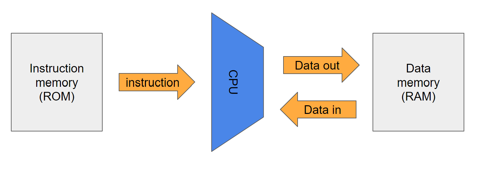

# nand2tetris
[Build a Modern Computer from First Principles: From Nand to Tetris](https://www.nand2tetris.org/) offered by Hebrew University of Jerusalem

# Objective
Build a fully functioning general purpose computer, both hardware and software components, from scratch.\
This computer follows [Von Neumann Architecture](https://www.computerscience.gcse.guru/wp-content/uploads/2016/04/Von-Neumann-Architecture-Diagram.jpg).
# What I have learned from the course
## Week 1
Project: implement boolean logic of 15 elementary logic gates using Hardware Description Language (HDL)

### 2 ways to describe a boolean function:
1. Boolean formula
2. Truth table
   
Going from (1) -> (2): substitute possible input values and evaluate the output\
Going from (2) -> (1): construct a disjunctive normal form formula and simplify the expression using boolean identities

### Boolean Identities

### Important & Interesting Theorem
Any boolean function can be represetned only using AND, NOT and OR gates\
--> Any boolean function can be represetned only using AND and NOT gates
  > Proof: X or Y = NOT (NOT X AND NOT Y) --  De Morgan's Law

--> Any boolean function can be represetned only using NAND gates
  > Proof: \
  > NOT X = NOT (X AND X) = X NAND X \
  > X AND Y = NOT (NOT (X AND Y)) = NOT (X NAND Y)

### Interface VS Implementation of a Gate
| Interface    | Implementation |
| -------- | ------- |
| *how* does it do it? | *what* is it supposed to do? |
| Not unique (multiple implementations possible for a gate) | unique (only 1 for a gate) |

[Logic gate diagrams](https://logancollinsblog.files.wordpress.com/2020/06/table1.png?w=340&h=619)

### Miscellaneous 
- Bus: multiple bits that are manipulated together as one entity
- HDL: functional/declarative language. It does not describe procedures/executions but a static structure of a chip, so the order of statements is not important

## Week 2
Project: build Arithmetic Logic Unit (ALU) 

### Numbers we can represent with n bits
If all positive: 0 ~ 2n-1\
If including negative numbers (using 2's complement): 
- positive range: 0 ~ 2n-1-1   --> MSB = 0
- negative range: -2n-1 ~ -1   --> MSB = 1

### 2's Complement
If there is a n-bit binary number, -x is represented as 2n-x \
So how do we compute -x? -x = 2n-x = 1 + (2n-1) - x --> just flip bits of x and add 1\
[Why using 2's complement to represent negative works well](https://math.stackexchange.com/questions/1920772/why-twos-complement-works)? Essentially turn subtraction into addition

### Adding two binary numbers
Overflow occurs when there is a carry from the MSB. This gets ignored by computer effectively making it arithmetic modulo of 2n

### Adders
- Half Adder: add 2 input bits and outputs a sum and a carry bit
- Full Adder: add 3 input bits and outputs a sum and a carry bit

## Week 3
Project: build Random Access Memory (RAM) 

### Combinational Logic VS Sequential Logic
|         | Combinational    | Sequential |
|---------| -------- | ------- |
| Purpose | To compute output givn the input values | To preserve data (state) over time |
| Time dependent | No, output is computed immediately\ `out[t] = in[t]` | Yes, it remembers *now* at time t what was injected *before*\ `out[t] = in[t-1]` |
| Basic element | Logic gates | Flip-flops |
| Example | ALU | Memory |

### Building Blocks of RAM and Important Terms
1. Clock
   - oscillator that generates signals alternating between 0 and 1 at a fixed rate
   - 1 cycle = 1 discrete time unit (for simplicity, although time is actually continuous); A cycle should be long enough to account for propagation delays and to signals to stabilize
   - a small triangle symbol on a chip diagram indicates that it takes clock input
2. Flip-flop: there are many types, but we are focusing on Data Flip-flop (DFF) here
   - it "moves" input from time t to output at time t+1 (aka remembers the previous state): `out[t] = in[t-1]`
   - takes 1-bit input, clock output and generates 1-bit output
   - **important: It remembers the state for only 1 time unit** 
3. 1-bit Register
   - a storage device that can remember the input *forever* unless it is told to load a new value
   - takes 1-bit input, load bit and clock input. Generates 1-bit output
   - `if load[t-1] == 1, out[t] = in[t-1]; else: out[t] = out[t-1]`
   - how to build 1-bit register using DFF: [diagram](https://i.stack.imgur.com/XjmZNm.png)
      - output is either in[t-1] or output[t-1] depending on the load bit --> requires a mux
      - `else` portion requires a feedback loop
   - register's state = the value currently stored "inside" the register
   - width (w) = # of bits it holds (for multi-bit register)
   - word = the content of multi-bit register
   - register is the most basic element of memory
4. RAM
   - a main memory of computer that stores both data and instructions
   - a sequence of n registers that are individually addressable (address range: 0 ~ n-1)
   - width of address bit (k) = log2(n)
   - only one register is in action at any given time
   - takes input of width `w`, address bits of size `k`, a load bit and the clock input. Output size is also `w`
   - to read register `i`: set address=`i` and probe output. The output should be the state of register `i`
   - to write `v` to register `i`: set address=`i`, in=`v`, load=1. The state of register `i` becomes `v` and from the next cycle onward, out=`v`
   - why called "random access"? Irrespective of the size of memory, meaning # of registers inside, any chosen register can be access in the same amount of time
5. Program Counter (PC)
   - contains the address of instruction that needs to be executed next
   - Three possible control settings:
      - reset (fetch the first instruction): PC = 0
      - increment (fetch the next instruction): PC++
      - goto (skip to instruction n): PC = n
   - has three control bits (reset, inc, load) along with input bits and the clock input

## Week 4
Project: Writing programs with assembly language

### Assembly, Assembler
- Assembly: a low-level symbolic language
- Assembler: translate assembly programs into binary code (machine language). HW fetches, interprets and executes these instructions.
- So assembly language and binary code are 2 different expressions for the same semantics (assembly - friendly for humans, binary - friendly for computers)

### Machine Language
- specification of interface between SW and HW. It only consists of 0s and 1s, so pretty much unreadable to humans, but it is designed to manipulate HW directly.
- Usually there are following types of machine language instructions:
  1. Perform arithmetic and logical operations
  2. Fetch and store values from the memory
  3. Move values from a register to another
  4. Test boolean conditions

### Important HW Components

- Memory:
   - Purpose: store data and instructions
   - Structure: an array of cells of a fixed length (called "word"). Each cell has its own unique address
   - Notation used: `Memory[addr]` `RAM[addr]` `M[addr]`
- Processor (CPU):
   - Purpose: perform a set of elementary operations (ex) arithmetic, logic, memory access, branching
   - contantly have to interact with the memeory to get the operands and store the result of the operation in registers or selected memory location
- Register:
   - Purpose: hold 1 value, served as a high-speed local memory. Faster to access than the main memory, which is bigger and further away
   - Structure: similar to memory, a register has a fixed width (word size)
- Input/Output Device
   - CPU needs a protocol (a set of rules) to talk to an I/O device. SW driver knows and handles this protocol
   - I/O device has a specific memeory location designated to itself to store its data
   - (ex) Mouse -> uses memory addr 12345 to store the last cursor position

### Specifically, HACK Computer HW

- ~~Von Neumann architecture~~ (I think it is closer to Harvard architecture. See [here](https://courses.cs.washington.edu/courses/cse490h1/19wi/exhibit/john-von-neumann-1.html)): same computer can be used for different objectives based on the program it's running (universality of computer)
- Memory address space: 15 bits -> have 2^15 (32768 = 32k) locations in the memory 
- 16-bit machine -> meaning, word size is 16 bits. Registers store 16-bit values and data/instructions in the memory are also 16 bits
- Registers:
   - D register: inside CPU
   - A register: inside CPU
   - M register: inside RAM. Represent RAM register addressed by A. There can only be one `M` at a time. (i.e. `M = RAM[A]`)
- Screen (output device):
   - 512 * 256 pixels. Since each pixel is 1 bit (turn on/off), we need 131072 bits to represent the full screen
   - Each memory location can hold 16 bits. 131072/16 = 8192 = 8*1024 locations should be allocated
   - 16 bits * 32 = 512 bits --> 1 row is spread across 32 consecutive addresses
   - Remember that word size (the atomic unit) is 16 bits, therefore we cannot access an individual bit but access the whole word
   - (ex) want to access screen(r, c) -> The target word is: RAM[16384 + r * 32 + c/16]. Within that word, (c % 16)th bit is the one we want
- Keyboard (input device):
   - Single word memory map located at address 24576
   - When a key is pressed, 16 bit ASCII code. When key is not pressed, the whole word is 0
 
### HACK Computer Instructions
- A (addressing) instructions: set A register to 15-bit value that represents a memory address
   - Syntax: (symbolic representation) `@value` | (binary representation) `0vvv vvvv vvvv vvvv`
   - Purpose:
        1. Only way to enter a constant into computer
        2. Prerequisite step for the next C instruction designed to manipulate the data memory
        3. Prerequisite step for a jump (branching), because it specifies the jump destination
- C (conditional) instructions: control the flow of the program
   - Syntax: `dest = comp; jump`
      - destination: where to store the computed value
      - compute: what to compute
      - jump: what instruction to execute next
   - Purpose:
      - allow repetitions (loops), conditional statements and subroutine calling

### HACK Computer Symbols
Predefined symbols for a special subset of RAM addresses
1. Virtual registers: R0-R15 (equivalent to M[0]-M[15]
2. Predefined pointers: SP(R0), LCL(R1), ARG(R2), THIS(R3), THAT(R4)
3. I/O pointers: SCREEN(=M[16384]), KBD(=M[24576]) NOTE - 16384 and 24576 are base addresses of the memory map

**Label symbols** are user-defined symbols used to label destinations of `goto` commands. It can only be defined once and can be used anywhere in the program even before the definition.
**Variable symbols** - assembler chooses an unique memory address starting M[16]

### 3 Different Modes of Memory Access 
1. Direct addressing: specify address or use a symbol that represents the address
   - (ex) LOAD R1, 67 // Mem[67] -> R1
   - (ex) LOAD R1, bar 
2. Immediate addressing: load constants
   - (ex) LOADI R1, 67 // 67 -> R1
3. Indirect addressing: instruction specifies a _memory location_ that contains the target address (i.e. value in a memory location refers to another address, not a data). Used to handle pointers
   - (ex)
     > High level: `x = foo[j]`
     > 
     > this is `foo` array-> [*| | | | | | | | ] ( `*` represents the base address)
     >
     > Machine language translation:
     >
     > ADD R1, foo, j // foo + j -> R1
     >
     > LOAD* R2, R1   // Mem[R1] -> R2
     >
     > STORE R2, x    // R2 -> x 

### Syntax Conventions & File Format
- Binary code file: .hack extension, each line = sequence of 16 0s and 1s = 1 machine instruction
- Assembly language file: .asm extension, each line = either an A instruction, C instruction or a symbol declaration (Note that symbol declaration is a pseudo-command that does not generate an equivalent machine code. It only causes the assembler to assign the label `symbol` to the memory location of the instruction that follows `(symbol)` statement)
- Constants: positive #s written in decimal format
- Symbols: cannot start with a digit, but can consist of digits, letters, underscores, dots, dollar signs and colons
- Comments: `//`
- Whitespace: can be used for better readability, but get ignored by the assembler
- Case Convention (HACK is case-sensitive!):
   - Assembly mnemonics -> all caps
   - Labels -> all caps
   - Variables -> lower case
- End the program with an infinite loop, otherwise the program will keep going
